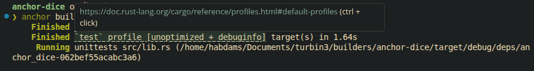
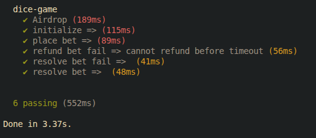

# Solana Dice Game

A simple Solana dice game built with Anchor to demonstrate instruction introspection and transaction validation.

## Features

- Initialize game state
- Place a bet
- Refund a bet
- Resolve a bet
- Instruction introspection for transaction verification
- Automated tests using TypeScript

## Project Structure

```text
programs/
tests/
migrations/
Anchor.toml
```

## Build

Build the program using:

```bash
anchor build
```

### Build Output



---

## Tests

Run the test suite with:

```bash
anchor test
```

The test flow covers:

- Airdropping SOL to test accounts
- Initializing the game
- Placing bets
- Refunding bets
- Resolving bets
- Failure scenarios and validation checks

### Test Output



---

## Learning Objectives

This project demonstrates:

- Solana instruction introspection
- Cross-instruction validation
- Anchor account management
- Program testing with TypeScript
- PDA usage and transaction security

## Tech Stack

- Rust
- Anchor Framework
- TypeScript
- Solana
